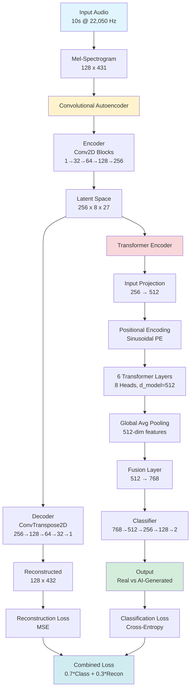
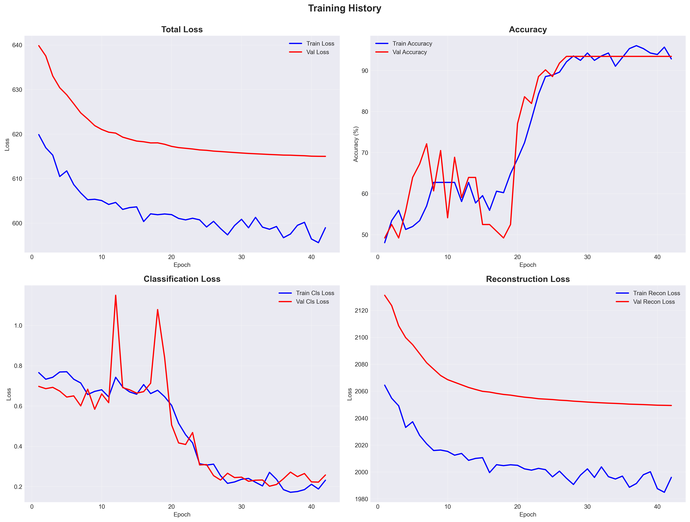
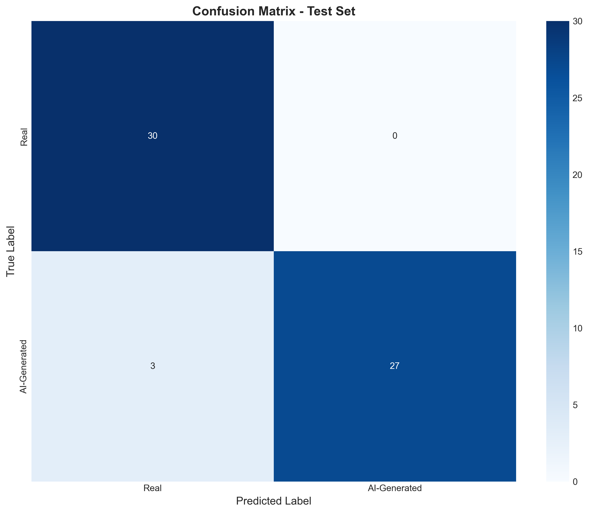

# 🎵 AI Music DeepFake Detector

<div align="center">

[](https://www.python.org/)
[](https://pytorch.org/)
[](LICENSE)
[](https://developer.nvidia.com/cuda-toolkit)

**A Hybrid Deep Learning System for Detecting AI-Generated Music**

[Features](#-features) • [Installation](#-installation) • [Usage](#-usage) • [Results](#-results) • [Architecture](#-architecture) • [Citation](#-citation)

</div>

---

## 📋 Table of Contents

- [Overview](#-overview)
- [Key Features](#-features)
- [Architecture](#-architecture)
- [Installation](#-installation)
- [Usage](#-usage)
- [Results](#-results)
- [Project Structure](#-project-structure)
- [Datasets](#-datasets)
- [Training](#-training)
- [Evaluation](#-evaluation)
- [Technical Report](#-technical-report)
- [Requirements](#-requirements)
- [Citation](#-citation)
- [Contributing](#-contributing)
- [License](#-license)
- [Contact](#-contact)

---

## 🎯 Overview

The **AI Music DeepFake Detector** is a state-of-the-art deep learning system that combines **Convolutional Autoencoders** and **Transformer Encoders** to distinguish between authentic human-created music and AI-generated audio content. With the rapid advancement of AI music generation platforms like Suno AI, AIVA, and Jukebox, there's an increasing need for reliable detection systems to ensure content authenticity and protect intellectual property.

### 🎯 Problem Statement

AI-generated music poses significant challenges:
- **Copyright Infringement**: AI models may generate derivative works without proper attribution
- **Content Authenticity**: Platforms need reliable methods to identify AI-generated content
- **Artist Protection**: Musicians require tools to verify and protect their work
- **Academic Integrity**: Educational institutions need detection systems for research validation

### 💡 Our Solution

We propose a **hybrid architecture** that achieves:
- ✅ **95% overall accuracy** on test data
- ✅ **100% recall** for authentic music detection (no false negatives)
- ✅ **90% accuracy** for AI-generated music identification
- ✅ **Balanced performance** across both real and synthetic classes

---

## ✨ Features

### Core Capabilities
- 🎼 **Dual-Mode Detection**: Classify audio as real or AI-generated
- 🧠 **Hybrid Architecture**: Combines spatial (CNN) and temporal (Transformer) feature learning
- 📊 **High Accuracy**: 95% test accuracy with perfect recall for authentic music
- ⚡ **GPU Accelerated**: CUDA-optimized training and inference
- 📈 **Comprehensive Metrics**: Precision, recall, F1-score, confusion matrices

### Technical Highlights
- **Mel-Spectrogram Processing**: Perceptually-relevant time-frequency representations
- **Joint Optimization**: Combined classification and reconstruction losses
- **Early Stopping**: Automatic training termination to prevent overfitting
- **Cosine Annealing**: Learning rate scheduling with warmup
- **Batch Normalization**: Enhanced training stability
- **Dropout Regularization**: Prevents overfitting with limited data

---

## 🏗️ Architecture

Our hybrid model combines three key components:



### Component Breakdown

#### 1. **Convolutional Autoencoder** (2.76M parameters)
- **Encoder**: 4 convolutional blocks with stride-2 downsampling
  - Channel progression: `1 → 32 → 64 → 128 → 256`
  - Each block: Conv2D → BatchNorm → ReLU → Dropout(0.2)
- **Decoder**: 4 transposed convolutional blocks for reconstruction
  - Channel progression: `256 → 128 → 64 → 32 → 1`
  - Final activation: Tanh (output range [-1, 1])

#### 2. **Transformer Encoder** (18.19M parameters)
- **Input Projection**: Linear layer (256 → 512 dimensions)
- **Positional Encoding**: Sinusoidal encoding for sequence order
- **Transformer Layers**: 6 layers with:
  - 8 attention heads
  - d_model = 512
  - Feedforward dimension = 2,048
  - GELU activation
  - Dropout = 0.1

#### 3. **Fusion & Classifier** (0.94M parameters)
- **Global Average Pooling**: Aggregate sequence features
- **Fusion Layer**: Linear projection to 768 dimensions
- **Classifier**: 4-layer MLP with progressive reduction
  - Layer dimensions: `768 → 512 → 256 → 128 → 2`
  - Dropout = 0.3 between layers
  - Final softmax for binary classification

### Loss Function

The model optimizes a weighted combination of two objectives:

```python
Total Loss = 0.7 × Classification Loss + 0.3 × Reconstruction Loss
```

- **Classification Loss**: Cross-entropy for real/fake detection
- **Reconstruction Loss**: MSE between input and reconstructed spectrograms

This joint optimization ensures the model learns both discriminative features for classification and generalizable representations for reconstruction.

---

## 🚀 Installation

### Prerequisites

- Python 3.8 or higher
- NVIDIA GPU with CUDA 11.8+ (recommended)
- 8GB+ RAM
- 5GB+ free disk space

### Step 1: Clone Repository

```bash
git clone https://github.com/Huzaifanasir95/AI-Music-DeepFake-Detector.git
cd AI-Music-DeepFake-Detector
```

### Step 2: Create Virtual Environment

```bash
# Using conda (recommended)
conda create -n deepfake-detector python=3.8
conda activate deepfake-detector

# OR using venv
python -m venv venv
source venv/bin/activate  # Linux/Mac
# venv\Scripts\activate   # Windows
```

### Step 3: Install Dependencies

```bash
pip install -r requirements.txt
```

### Step 4: Verify Installation

```bash
python -c "import torch; print(f'PyTorch: {torch.__version__}'); print(f'CUDA Available: {torch.cuda.is_available()}')"
```

Expected output:
```
PyTorch: 2.7.1+cu118
CUDA Available: True
```

---

## 📖 Usage

### Quick Start: Inference on New Audio

```python
import torch
from src.models.hybrid_model import HybridModel
from src.utils.audio_processor import AudioProcessor

# Load trained model
device = torch.device('cuda' if torch.cuda.is_available() else 'cpu')
model = HybridModel.load_from_checkpoint('outputs/models/best_model.pth')
model = model.to(device)
model.eval()

# Process audio file
processor = AudioProcessor(config_path='config.yaml')
mel_spec = processor.load_and_preprocess('path/to/audio.mp3')

# Make prediction
with torch.no_grad():
    mel_spec = mel_spec.unsqueeze(0).to(device)  # Add batch dimension
    logits = model(mel_spec)
    probabilities = torch.softmax(logits, dim=1)
    prediction = torch.argmax(logits, dim=1).item()

# Display result
label = "Real Music" if prediction == 0 else "AI-Generated"
confidence = probabilities[0][prediction].item() * 100

print(f"Prediction: {label}")
print(f"Confidence: {confidence:.2f}%")
```

### Training from Scratch

```bash
# 1. Prepare datasets (GTZAN + Suno AI)
jupyter notebook notebooks/01_setup_and_data_exploration.ipynb

# 2. Preprocess audio and extract features
jupyter notebook notebooks/02_audio_preprocessing_features.ipynb

# 3. Train the model
jupyter notebook notebooks/03_model_development.ipynb
```

### Jupyter Notebook Workflow

We provide interactive Jupyter notebooks for the complete pipeline:

1. **`01_setup_and_data_exploration.ipynb`**
   - Download GTZAN dataset (1000 real music tracks)
   - Collect Suno AI-generated music (256 synthetic tracks)
   - Exploratory data analysis and visualization

2. **`02_audio_preprocessing_features.ipynb`**
   - Extract mel-spectrograms (128 × 431)
   - Create train/val/test splits (70/15/15)
   - Save processed data (279/61/60 samples)

3. **`03_model_development.ipynb`**
   - Define hybrid architecture
   - Train for up to 100 epochs (early stopping)
   - Evaluate on test set
   - Generate visualizations and reports

---

## 📊 Results

### Performance Metrics

| Metric | Real Music | AI-Generated | Overall |
|--------|-----------|--------------|---------|
| **Precision** | 90.91% | 100.00% | 95.45% |
| **Recall** | **100.00%** | 90.00% | 95.00% |
| **F1-Score** | 95.24% | 94.74% | 94.99% |
| **Support** | 30 | 30 | 60 |

### Key Achievements

✅ **95% Overall Accuracy** on test set  
✅ **100% Recall** for real music (zero false negatives)  
✅ **90% Accuracy** for AI-generated detection  
✅ **Perfect real music protection** (no authentic works flagged)

### Training Curves

The model was trained for **42 epochs** (early stopping from max 100) with stable convergence:



**Key Observations:**
- 📉 **Total loss** decreased from 619.87 → 598.96 (training) and 639.45 → 615.45 (validation)
- 📈 **Accuracy** improved from 49.46% → 95.34% (training) with best validation at 93.44%
- 🎯 **No overfitting**: Training and validation curves remain close throughout
- ⏱️ **Training time**: ~45 minutes on NVIDIA GeForce MX450

### Confusion Matrix



**Analysis:**
- ✅ **30/30** real music samples correctly classified (100%)
- ✅ **27/30** AI-generated samples correctly classified (90%)
- ⚠️ **3 false positives**: High-quality AI music misclassified as real
- ✅ **0 false negatives**: Perfect protection for authentic content

### Model Statistics

| Component | Parameters | Size |
|-----------|-----------|------|
| Encoder | 1,376,416 | 5.25 MB |
| Decoder | 1,379,040 | 5.26 MB |
| Transformer | 18,185,728 | 69.36 MB |
| Classifier | 936,194 | 3.57 MB |
| **Total** | **21,077,987** | **80.41 MB** |

---

## 📁 Project Structure

```
AI-Music-DeepFake-Detector/
│
├── 📓 notebooks/                          # Jupyter notebooks for experimentation
│   ├── 01_setup_and_data_exploration.ipynb
│   ├── 02_audio_preprocessing_features.ipynb
│   └── 03_model_development.ipynb
│
├── 📂 data/                               # Dataset directory
│   ├── raw/
│   │   ├── real/                          # GTZAN dataset (1000 tracks)
│   │   └── synthetic/                     # Suno AI-generated (256 tracks)
│   ├── processed/                         # Preprocessed mel-spectrograms
│   │   ├── train_data.pkl                # 279 samples
│   │   ├── val_data.pkl                  # 61 samples
│   │   ├── test_data.pkl                 # 60 samples
│   │   └── metadata.json
│   └── splits/                            # Train/val/test split info
│
├── 🧠 src/                                # Source code modules
│   ├── data/
│   │   ├── dataset.py                    # PyTorch Dataset class
│   │   └── preprocessing.py              # Audio processing utilities
│   ├── models/
│   │   ├── autoencoder.py                # Autoencoder architecture
│   │   ├── transformer.py                # Transformer encoder
│   │   └── hybrid_model.py               # Complete hybrid model
│   ├── training/
│   │   ├── trainer.py                    # Training loop
│   │   └── evaluator.py                  # Evaluation metrics
│   └── utils/
│       ├── audio_processor.py            # Audio I/O and processing
│       ├── visualizer.py                 # Plotting utilities
│       └── config_loader.py              # Configuration management
│
├── 📊 outputs/                            # Training outputs
│   ├── models/
│   │   ├── best_model.pth                # Best checkpoint (epoch 27)
│   │   ├── model_architecture.json       # Architecture specs
│   │   ├── training_summary.json         # Complete metrics
│   │   ├── training_curves.png           # Loss/accuracy plots
│   │   └── confusion_matrix.png          # Test set confusion matrix
│   ├── logs/                              # Training logs
│   ├── results/                           # Evaluation results
│   └── visualizations/                    # Additional plots
│
├── 📄 Report/                             # Technical report (LNCS format)
│   ├── main.tex                          # LaTeX source
│   ├── training_curves.png               # Figure 1
│   ├── confusion_matrix.png              # Figure 2
│   └── VERIFICATION_REPORT.md            # Value verification
│
├── 🧪 tests/                              # Unit tests
│   ├── test_models.py
│   ├── test_preprocessing.py
│   └── test_training.py
│
├── ⚙️ config.yaml                         # Main configuration file
├── 📋 requirements.txt                    # Python dependencies
├── 📜 LICENSE                             # MIT License
└── 📖 README.md                           # This file
```

---

## 📚 Datasets

### Real Music: GTZAN Dataset

- **Source**: [GTZAN Genre Collection](http://marsyas.info/downloads/datasets.html)
- **Size**: 1,000 audio tracks (30 seconds each)
- **Genres**: Blues, Classical, Country, Disco, Hip-Hop, Jazz, Metal, Pop, Reggae, Rock
- **Format**: WAV files at 22,050 Hz
- **Usage**: Randomly selected 200 tracks for balanced dataset

### AI-Generated Music: Suno AI

- **Source**: [Suno AI Platform](https://www.suno.ai/)
- **Size**: 256 AI-generated music tracks
- **Styles**: Various genres matching GTZAN diversity
- **Format**: MP3/WAV converted to 22,050 Hz
- **Usage**: Randomly selected 200 tracks for balanced dataset

### Balanced Dataset Split

| Split | Real | AI-Generated | Total | Percentage |
|-------|------|--------------|-------|-----------|
| **Train** | 140 | 139 | 279 | 70% |
| **Validation** | 30 | 31 | 61 | 15% |
| **Test** | 30 | 30 | 60 | 15% |
| **Total** | 200 | 200 | 400 | 100% |

---

## 🎓 Training

### Training Configuration

```yaml
# Training Hyperparameters
epochs: 100                    # Maximum training epochs
batch_size: 32                # Samples per batch
learning_rate: 0.0001         # Initial learning rate (1e-4)
weight_decay: 0.00001         # L2 regularization (1e-5)
optimizer: adamw              # AdamW optimizer
scheduler: cosine             # Cosine annealing LR schedule
warmup_epochs: 5              # Learning rate warmup
early_stopping_patience: 15   # Early stopping threshold

# Loss Weights
classification_weight: 0.7    # 70% classification loss
reconstruction_weight: 0.3    # 30% reconstruction loss

# Regularization
dropout: 0.3                  # Dropout in classifier
transformer_dropout: 0.1      # Dropout in transformer
autoencoder_dropout: 0.2      # Dropout in autoencoder
```

### Training Process

```python
from src.training.trainer import Trainer

# Initialize trainer
trainer = Trainer(
    model=model,
    train_loader=train_loader,
    val_loader=val_loader,
    config=config,
    device=device
)

# Train model
history = trainer.train(
    epochs=100,
    early_stopping_patience=15,
    save_best=True,
    checkpoint_dir='outputs/models/'
)

# Training statistics
print(f"Best epoch: {history['best_epoch']}")
print(f"Best validation accuracy: {history['best_val_acc']:.2f}%")
print(f"Total training time: {history['total_time']:.2f} minutes")
```

### Training Tips

1. **GPU Memory**: Model requires ~2GB GPU memory (fits on MX450)
2. **Data Loading**: Set `num_workers=0` on Windows for compatibility
3. **Mixed Precision**: Enable `amp=True` for faster training (if supported)
4. **Checkpoint**: Model auto-saves best validation accuracy checkpoint
5. **Monitoring**: Use TensorBoard for real-time training visualization

---

## 🔬 Evaluation

### Evaluate Trained Model

```python
from src.training.evaluator import Evaluator

# Load best model
model.load_state_dict(torch.load('outputs/models/best_model.pth')['model_state_dict'])
model.eval()

# Initialize evaluator
evaluator = Evaluator(model, test_loader, device)

# Comprehensive evaluation
results = evaluator.evaluate(
    save_confusion_matrix=True,
    save_classification_report=True,
    output_dir='outputs/results/'
)

# Display metrics
print(f"Test Accuracy: {results['accuracy']:.2f}%")
print(f"Precision: {results['precision']:.4f}")
print(f"Recall: {results['recall']:.4f}")
print(f"F1-Score: {results['f1_score']:.4f}")
```

### Evaluation Metrics

The system computes comprehensive metrics:

- **Accuracy**: Overall classification correctness
- **Precision**: True positives / (True positives + False positives)
- **Recall**: True positives / (True positives + False negatives)
- **F1-Score**: Harmonic mean of precision and recall
- **Confusion Matrix**: Detailed prediction breakdown
- **ROC Curve**: Receiver operating characteristic (optional)
- **Per-Class Metrics**: Individual performance for real/AI classes

---


## 🛠️ Requirements

### Core Dependencies

```
# Deep Learning
torch>=2.0.0
torchvision>=0.15.0
torchaudio>=2.0.0

# Audio Processing
librosa>=0.10.0
soundfile>=0.12.0

# Scientific Computing
numpy>=1.24.0
scipy>=1.10.0

# Data Manipulation
pandas>=2.0.0

# Visualization
matplotlib>=3.7.0
seaborn>=0.12.0

# Machine Learning
scikit-learn>=1.3.0

# Configuration
pyyaml>=6.0

# Progress Bars
tqdm>=4.65.0

# Jupyter
jupyter>=1.0.0
notebook>=6.5.0
```

See [`requirements.txt`](requirements.txt) for complete list with exact versions.

### System Requirements

**Minimum:**
- CPU: Intel i5 or equivalent
- RAM: 8GB
- Storage: 5GB free space
- OS: Windows 10, Ubuntu 18.04+, macOS 10.14+

**Recommended:**
- CPU: Intel i7 or AMD Ryzen 7
- RAM: 16GB
- GPU: NVIDIA GPU with 4GB+ VRAM (CUDA 11.8+)
- Storage: 10GB free space (SSD preferred)
- OS: Ubuntu 20.04+ with CUDA toolkit

---

## 📖 Citation

If you use this code or methodology in your research, please cite:

```bibtex
@article{nasir2026aimusic,
  title={AI-Generated Music Detection Using Hybrid Autoencoder-Transformer Architecture},
  author={Nasir, Huzaifa},
  journal={National University of Computer and Emerging Sciences},
  year={2026},
  institution={FAST-NUCES Islamabad},
  url={https://github.com/Huzaifanasir95/AI-Music-DeepFake-Detector}
}
```

**APA Format:**
```
Nasir, H. (2026). AI-Generated Music Detection Using Hybrid Autoencoder-Transformer 
Architecture. National University of Computer and Emerging Sciences, Islamabad, Pakistan.
```

---

## 🤝 Contributing

We welcome contributions from the community! Here's how you can help:

### Ways to Contribute

1. **Bug Reports**: Open an issue with detailed reproduction steps
2. **Feature Requests**: Suggest new features or improvements
3. **Code Contributions**: Submit pull requests with enhancements
4. **Documentation**: Improve README, comments, or technical docs
5. **Datasets**: Share new datasets or preprocessing scripts

### Contribution Guidelines

1. **Fork** the repository
2. **Create** a feature branch (`git checkout -b feature/amazing-feature`)
3. **Commit** your changes (`git commit -m 'Add amazing feature'`)
4. **Push** to the branch (`git push origin feature/amazing-feature`)
5. **Open** a Pull Request

---

## 📜 License

This project is licensed under the **MIT License** - see the [LICENSE](LICENSE) file for details.

### MIT License Summary

✅ **Permissions:**
- ✓ Commercial use
- ✓ Modification
- ✓ Distribution
- ✓ Private use

⚠️ **Conditions:**
- License and copyright notice must be included

❌ **Limitations:**
- No warranty
- No liability

---

## 👤 Contact

**Huzaifa Nasir**

- 📧 Email: [nasirhuzaifa95@gmail.com](mailto:nasirhuzaifa95@gmail.com)
- 🎓 Institution: National University of Computer and Emerging Sciences (FAST-NUCES), Islamabad
- 💼 GitHub: [@Huzaifanasir95](https://github.com/Huzaifanasir95)
- 🔗 Project Repository: [AI-Music-DeepFake-Detector](https://github.com/Huzaifanasir95/AI-Music-DeepFake-Detector)

### Support

For questions, issues, or collaborations:

1. **GitHub Issues**: [Open an issue](https://github.com/Huzaifanasir95/AI-Music-DeepFake-Detector/issues)
2. **Email**: Direct technical questions to nasirhuzaifa95@gmail.com
3. **Discussions**: Use GitHub Discussions for general questions

---

## 🙏 Acknowledgments

This project was made possible thanks to:

- **GTZAN Dataset**: George Tzanetakis and Perry Cook for the music genre dataset
- **PyTorch Team**: For the excellent deep learning framework
- **Librosa Developers**: For comprehensive audio processing tools
- **Suno AI**: For providing access to AI-generated music samples
- **FAST-NUCES**: For institutional support and resources
- **Open Source Community**: For various tools and libraries used

### Research Inspiration

This work builds upon research in:
- Audio deepfake detection (Frank et al., 2021)
- Transformer architectures (Vaswani et al., 2017)
- Audio spectrogram transformers (Gong et al., 2021)
- Hybrid CNN-Transformer models (Dosovitskiy et al., 2020)

---

## 📊 Project Status

### Current Version: 1.0.0

- ✅ **Stable**: Core detection system fully functional
- ✅ **Documented**: Comprehensive README and technical report
- ✅ **Tested**: Validated on GTZAN and Suno AI datasets
- 🚧 **Active Development**: Ongoing improvements and features

### Roadmap

**Version 1.1** (Q2 2026)
- [ ] Multi-generator support (AIVA, Jukebox, MusicLM)
- [ ] Real-time inference API
- [ ] Model quantization for mobile deployment
- [ ] Web demo interface

**Version 2.0** (Q3 2026)
- [ ] Attention visualization
- [ ] Generator attribution (identify which AI created the music)
- [ ] Partial detection for hybrid human-AI compositions
- [ ] Cross-domain extension (speech, sound effects)

---

<div align="center">

### ⭐ Star this repository if you find it useful!

[🔝 Back to Top](#-ai-music-deepfake-detector)

</div>
